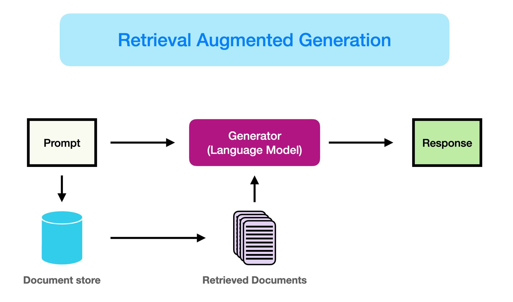

# LLM, RAG, and Agents

[*(Source of the image)*](https://www.promptingguide.ai/research/rag)

## Missions & Activities:
This Lab is organized in two parts:
1. In the first part, you will follow a tutorial to run a simple RAG (Retrieval Augmented Generation) technique. The idea is to improve LLMs (Large Language Models) by adding a retrieval component from an external data source. This means enriching the knowledge that the model gained from its pre-training with information retrieved from specific sources (text files, videos, etc.). As a case study, you will use the RAG system to develop a chatbot able to reliably answer questions about the manual of [Home I/O](https://docs.realgames.co/homeio/en/).
2. In the second part, you will implement a simple "agent". This agent will use a method called "tool or function calling" to:
- take vocal commands from the user
- transmit the commands to the Home I/O platform
- get a feedback from the platform

### Activity 1
- **Problem**: Develop a chatbot able to reliably answer questions about the manual of Home I/O. 
    - Example Prompt: "List the available detectors in Home I/O."
    - Example Answer: "The available detectors in Home I/O are: Close doors detector, Motion Detector, and Smoke Detector (source: https://docs.realgames.co/homeio/en/detectors/)."
- **Goal**: Implement a simple RAG system to develop a chatbot able to reliably answer questions about specific data sources. The chatbot should be able to answer the question accuraltely and provide a reference to the source of the information (e.g., the url of the webpage, the page of the document or the second in a video that contained the source of the informaiton provided in the answer).
    - (Nice to have) The chatbot should be able to find the information and to answer in English *and* in French.
- **Tools**: Small pretrained LLMs, Ollama, Vector database (FAISS or Chroma DB), and Langchain.
- **New/Consolidation of ML Glossary**: Large language model, Retrieval Augmented Generation, Embedding, Vector database, similarity score.

## Tasks
1. Follow anc complete the tutorial in the provided starting notebook.
2. Reply to the open questions in the notebook.

## Expected Outcomes:
- Python notebook with the code of the chatbot and the answers to the open questions.

### Activity 2
- **Problem**: Develop a simple "agent". We suggest an application that can take vocal commands from the user, transmit them to the Home I/O platform, and control smart-home devices.
    - Example of interaction:
        - Vocal prompt: "Turn on the lights in the kitchen."
        - Agent actions: Check the current state of the lights in the kitchen. If necessary, send the command to the Home I/O platform; get the new state of the lights in the kitchen.
        - Answer: "The lights in the kitchen are now turned on."
    

- **Goal**: Implement an "agent" able to understand vocal commands via speech recognition, use a function calling approach to interact with the Home I/O platform, and get vocal feedback (e.g., task successfully accomplished or not, status change, etc.).

NOTE: You are free to propose your own application of an agent. We expect a complexity level similar to the previous example. You can use AI to help you with the code *but*: you are the owner of the code. You MUST be able to explain everything going on in your code. Not being able of doing so, wmay comport a severe penalization on the final grade.

- **Tools**: Speech recognition (check [Whisper](https://github.com/openai/whisper)), tool/function calling with [Langchain](https://docs.langchain.com/oss/python/langchain/overview) and [LangGraph](https://docs.langchain.com/oss/python/langgraph/overview).
- **New/Consolidation of ML Glossary**: Agent, Function calling.

## Tasks
1. Implement the agent using the provided starting notebook.
2. Reply to the open questions in the notebook.

## Expected Outcomes:
- Python notebook with the code of the agent and the answers to the open questions.

# Installation
See the [uv tutorial](https://github.com/hei-synd-aml/lab-0-TutoUv) or create your own environment with the necessary packages. 